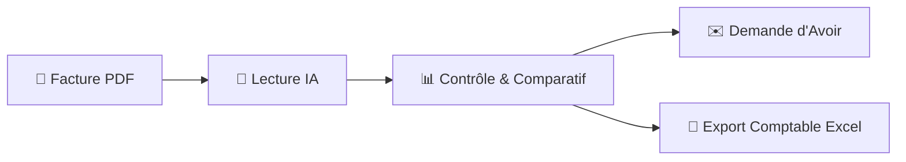

# 📘 Guide d'Utilisation : Contrôle des Factures, Suivi des Prix & Gestion Comptable

Bienvenue dans le guide de prise en main du module **Contrôle Fournisseurs & Comptabilité** de l'application **StockPro / Quentin Elec**.

---

## 🎯 Objectifs du module

1. **Gagner du temps** : Numérisation instantanée des factures distributeurs multi-pages (Rexel, Sonepar, YESSS Electrique, Balitran, etc.) par Intelligence Artificielle.
2. **Économiser de l'argent** : Détection automatique des hausses de prix non justifiées et génération d'e-mails de demande d'avoir en 1 clic.
3. **Comptabilité Analytique BTP** : Ventilation automatique de chaque ligne d'article sur le chantier correspondant pour connaître le coût matière réel.
4. **Export Comptable clé en main** : Génération d'un fichier Excel normalisé prêt pour votre logiciel comptable (Pennylane, Sage, EBP, Cegid, etc.).

---

## 🚀 Fonctionnement en 4 Étapes Simples

---

### Étape 1 : Importer une Facture Fournisseur (PDF)

1. Rendez-vous dans le menu **Factures F.**
2. Glissez-déposez votre facture PDF dans la zone en pointillés **« Glisser un PDF ici »**.
3. **L'IA analyse le document en quelques secondes** et extrait automatiquement :
   * Le **Fournisseur** (ex: *YESSS ELECTRIQUE, Rexel, Sonepar*)
   * Le **Numéro de facture** (ex: *061-007-000233*)
   * La **Date de facture** et la **Date d'échéance** (ex: *31/08/2026*)
   * Le **Mode de règlement** (ex: *LCR 30 jours Fin de Mois*)
   * Les totaux : **Total HT**, **Total TVA**, **Total TTC**
   * L'ensemble des **lignes d'articles** (Référence, Désignation, Quantité, Prix Unitaire Net HT)
   * Le **Chantier / Réf Client** rattaché à chaque bon de livraison (ex: *SCI PELICAN, HARVEY, WELDOM, STOCK*).

---

### Étape 2 : Contrôle & Détection des Hausses

1. Vérifiez les lignes dans le tableau pré-rempli (vous pouvez ajuster un prix ou un chantier si besoin).
2. Cliquez sur **« Enregistrer & Contrôler les Prix »**.
3. Le système compare immédiatement chaque prix avec le **meilleur prix historique** constaté :
   * 🟢 **OK (Conforme)** : Le prix est stable ou équivalent.
   * 🟢 **Baisse** : Le prix a baissé (bonne affaire).
   * 🔴 **Hausse** : Le prix est supérieur à votre historique. L'application calcule le surcoût total et déclenche une **Alerte Hausse**.

---

### Étape 3 : Réclamation d'Avoir en 1 Clic

Pour toute ligne en hausse (ou globalement pour toute la facture) :
1. Cliquez sur le bouton **« Réclamer »** (sur la ligne) ou **« Avoir Global »** (pour toute la facture).
2. Une fenêtre s'ouvre avec un **e-mail complet et professionnel déjà rédigé** avec :
   * L'article concerné et sa référence
   * Le prix historique vs le nouveau prix facturé
   * Le surcoût total exact en euros à vous rembourser
3. Choisissez votre mode d'envoi :
   * **🔴 Ouvrir dans Gmail** : Ouvre un nouvel onglet Gmail prêt à partir.
   * **📋 Copier le message** : Copie l'objet et le texte pour le coller où vous voulez (WhatsApp, mail commercial).
   * **✉️ Ouvrir logiciel de messagerie** : Ouvre votre messagerie locale (Outlook, Thunderbird).

---

### Étape 4 : Suivi des Avoirs & Export Comptable

#### 1. Cycle de vie des avoirs
Sur chaque anomalie de prix dans le tableau d'historique, vous pouvez changer le statut :
* `⏳ À réclamer` : Anomalie constatée, réclamation à faire.
* `📤 E-mail envoyé` : Demande transmise au commercial.
* `✅ Avoir reçu` : L'avoir a été accordé. Saisissez le N° d'avoir et le montant récupéré pour incrémenter le **Compteur d'Économies (€)** en haut de page.
* `❌ Refusé / Justifié` : Hausse justifiée (ex: changement de gamme).

#### 2. Export Comptable (Excel)
Cliquez sur le bouton vert **« Export Comptable (Excel) »** en haut à droite du tableau pour télécharger un fichier Excel complet contenant :
* Date Facture | Fournisseur | N° Facture | Date Échéance | Mode Règlement
* Chantier / Réf Client | Référence | Désignation | Quantité
* Prix Unitaire Net HT | Total Ligne HT | Meilleur Prix Hist. | Écart (€) | Surcoût (€)
* Statut Comparatif | Statut Avoir | N° Avoir Reçu | Montant Avoir Reçu | Totaux Facture

---

## 💡 Astuces & FAQ

### Que faire si le fournisseur utilise une référence différente ?
* Activez la case **« Créer alias Réf_Fournisseur ➔ Réf_Interne »** lors de l'enregistrement. L'application retiendra la correspondance pour tous les prochains comparatifs.

### Comment accéder au tutoriel dans l'application ?
* Cliquez sur l'onglet **Guide & Tuto** dans le menu de gauche pour suivre le guide interactif avec toutes les animations pas à pas.
